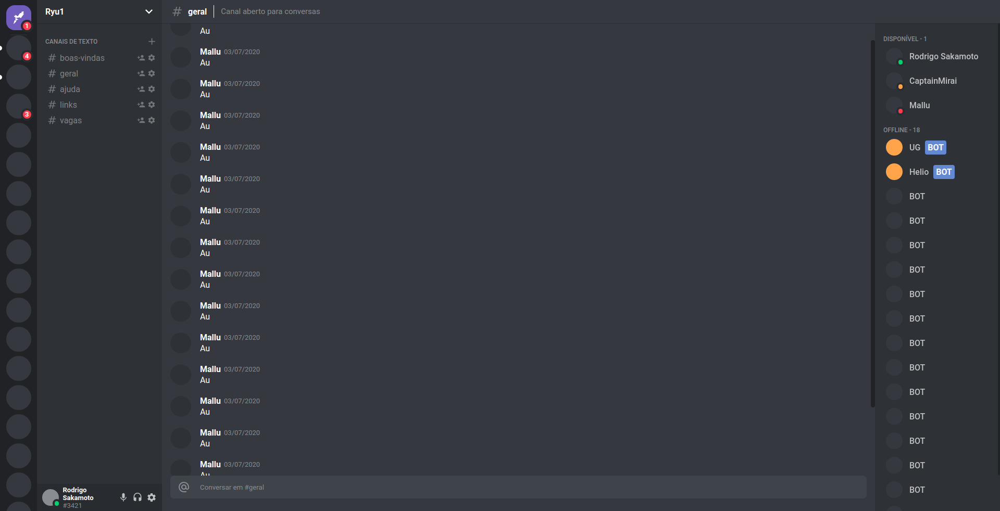

<h1 align="center" >
  Discord Clone
</h1>

<h3 align="center"> Um clone da interface do Discord feito com ReactJS</h3>


<p align="center">
  
</p>


<h4 align="center"><a href="https://discordry.netlify.app/">Clique aqui para visualizar o projeto</a></h3>

## 💾 Instalação

<h4>Execute os comandos abaixo</h4>

```bash
$ git clone https://github.com/rodrigosakamoto/discord-clone.git

$ cd discord-clone

# Em seguida execute:
$ yarn

$ yarn start
```
---
By [Rodrigo Sakamoto](https://www.linkedin.com/in/rodrigo-sakamoto/)
